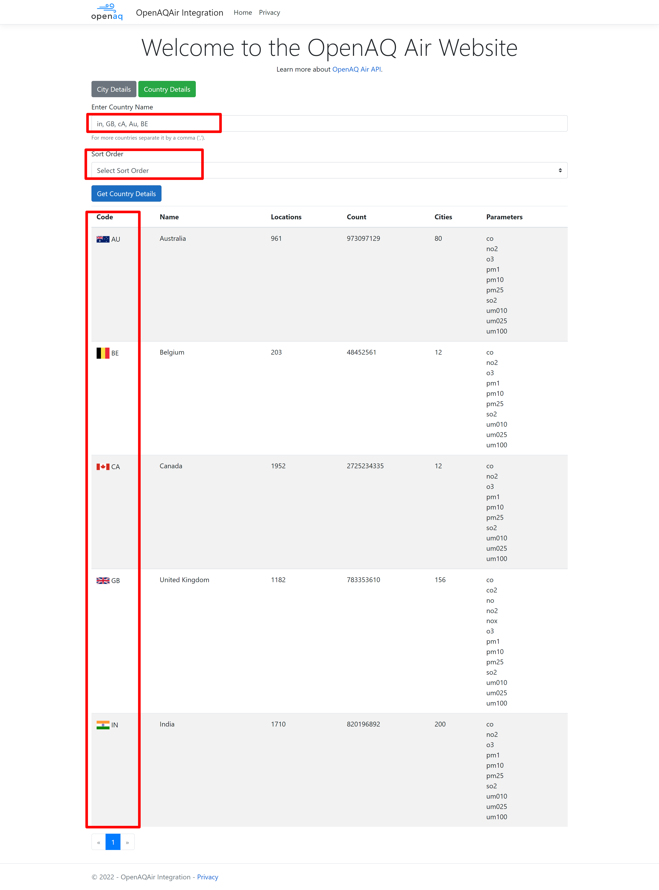

# OpenAQ API integration

The purpose of this code repository is to provide details about integration of [OpenAQ API](https://docs.openaq.org/docs/introduction) end-points using ASP.NET Core using  [Clean Architecture](#clean-architecture).

## Table Of Contents
- [Overview](#overview)
- [Architectural Overview](#architectural-overview)
  * [Application's design patterns](#applications-design-patterns)
    * [Dependency Inversion Principle](#dependency-inversion-principle)
    * [Repository Design Pattern](#repository-design-pattern)
    * [Domain-Driven Design](#domain-driven-design)  
            **>** [Building Blocks](#building-blocks)  
            **>** [DDD Concepts](#ddd-concepts)
  * [Application Layers](#application-layers)
  * [High Level Diagram](#high-level-diagram)
  * [Solution Explorer View](#solution-explorer-view)
- [Application Configurations](#application-configurations)
- [Application Cache](#application-cache)
- [Application Logging](#application-logging)
- [Application Integrations](#application-integrations)
    * [OpenAQ REST API](#openaq-rest-api)
- [Application Functionalities](#application-functionalities)
  * [City Based Details](#city-based-details)
    * [Single City Details](#single-city-details)
    * [Multiple Cities Details](#multiple-cities-details)  
            **>** [Ascending Order](#ascending-order)  
            **>** [Descending Order](#descending-order)
  * [Country Based Details](#country-based-details)
    * [All Countries Details](#all-countries-details)  
            **>** [Country in Ascending Order](#country-in-ascending-order)  
            **>** [Country in Descending Order](#country-in-descending-order)
    * [Pagination](#pagination)
    * [Multiple Countries Details](#multiple-countries-details)
- [Detailed section](#detailed-section)
  * [Clean Architecture](#clean-architecture)
  * [Credit/References](#credit-references)

# Overview
The OpenAQ Air application is an ASP.NET CORE MVC based web application and it will do the integration with the OpenAQ Air REST API to get the `air quality data`.

In this application, user's can get the air quality details based on City or Country. 

Solution consists of following core components:
- ASP.NET Core MVC Web Application
- OpenAQ Air REST API

This application is integratied with below applications/systems:
- [OpenAQ Air REST API](https://docs.openaq.org/docs/introduction)

# Architectural Overview
 The diagram below showing the overall application architecture in terms of layers and their components.

In this application, [Clean Architecture](https://blog.cleancoder.com/uncle-bob/2012/08/13/the-clean-architecture.html) being used used, this patterns always focus on the loosely coupled implementation of the application layers and the same rule applied into the application implementation.

The Domain and Application layers always lie in the design center. These two layers are known as the Core System. 

The core layer should not be dependent on any data access layers or any other infrastructure.

We have used the interfaces within the Core layer, which are usually implemented by layers outside the Core. For example, we we want to implement Repository design patterns, we can add an interface e.g. [ICityRepository](src/OpenAQAir.Domain/Interfaces/ICityRepository.cs) within the Core and its implementation within the infrastructure layer e.g. [CityRepository](src/OpenAQAir.Infrastructure/OpenAQAir/Repositories/CityRepository.cs). 

The best practice is that, all the dependencies flows must be inward towards Core Layer, and Core Layer does not have any dependency on any other layer. Of course, infrastructure and Presentation layers must depend on the Core. But both of them do not need to rely on each other.

  

In this application, i have divided 'Application Core' (from Clean Architecture) into two separate projects like 'Domain' and 'Application'. So 'Domain' project mostly contains 'Entites'(table entities) then 'Application' project contains 'DTO's', 'Interfaces', 'BusinessLogics',etc. So the 'Application' project depends on the 'Domain'. So 'Domain' project can be sharable with other projects as well since it is the parent of layers. 

> **You can find more details about `Clean Architecture` in [detailed section](#detailed-section).**

 

## Application's design patterns
---
 

### Dependency Inversion Principle
---

The Dependency Inversion Principle is one of the [SOLID Principles of Object-Oriented](https://www.educative.io/blog/solid-principles-oop-c-sharp) class design. 

This principle is about dependencies among components. The definition of DIP is given by Robert C. Martin is as follows:
1.	High-level modules should not depend on low-level modules. Both should depend on abstractions.
2.	Abstractions should not depend on details. Details should depend on abstractions.

The principle says that high-level modules should depend on abstraction, not on the details, of low-level modules. In simple words, the principle says that there should not be a tight coupling among components of software and to avoid that, the components should depend on abstraction.

The terms **Dependency Injection (DI)** and **Inversion of Control (IoC)** are generally used as interchangeably to express the same design pattern.

> Inversion of Control (IoC) is a technique to implement the Dependency Inversion Principle in C#. Inversion of control can be implemented using either an abstract class or interface. 

 

### Repository Design Pattern:
---
The [Repository Design Pattern](https://dotnettutorials.net/lesson/repository-design-pattern-csharp/) in mediates between the domain and the data mapping layers using a collection-like interface for accessing the domain objects.

In other words, we can say that a Repository Design Pattern acts as a middleman or middle layer between the rest of the application and the data access logic. 

That means a repository pattern isolates all the data access code from the rest of the application. The advantage of doing so is that, if you need to do any changes then you need to do it in one place.

Another benefit is that testing your controllers becomes easy because the testing framework need not run against the actual database access code. With repository design pattern, the previous diagram will change to the following diagram: 

 

### Domain-Driven Design
---

[Domain Driven Design](https://deviq.com/domain-driven-design/ddd-overview), first introduced by Eric Evans in 2003, is a software design strategy intended to take complex domains (real-world problems) and simplify them into a extensible and maintainable software solution.

[DDD](https://blog.airbrake.io/blog/software-design/domain-driven-design#:~:text=DDD%20focuses%20on%20three%20core,any%20emerging%20domain%2Drelated%20issues.) focuses on three core principles:

- Focus on the core domain and domain logic.
- Base complex designs on models of the domain.
- Collaboration with domain experts to improve the application model and resolve any emerging domain-related issues.
#### Building Blocks
- Entity
- Vaue Object
- Domain Event
- Aggregate
- Service
- Repositories
- Factories 

#### DDD Concepts
- Aggregate Pattern
- Anemic Model
- Anti-Corruption Layer
- Entity
- Repository Pattern
- Specification Pattern
- Ubiquitous Language
- Value Object

 

 ## Application Layers
 ---
  

 

 ## High Level Diagram
 ---
  

 

 ## Solution Explorer View
 ---
  

 

# Application Configurations
 
In this application required configuration managed from OpenAQAir.Web/[appsettings.json](src/OpenAQAir.Web/appsettings.json) file:
- OpenAQAir REST API End-point
- Default Page Size for the OpenAQAir REST API
- Log file path

  

 # Application Cache
 
In this application we are using In-Memory cache and following format being used to create the [Cache Key](src/OpenAQAir.Infrastructure/OpenAQAir/Extensions/CacheHelpers.cs):
> items-{0}-{1}-{2}-{3}-{4}-{5}

The duration of the cache key is 5 minutes and mentioned at [CacheHelpers.cs](src/OpenAQAir.Infrastructure/OpenAQAir/Extensions/CacheHelpers.cs).

**To make above values dynamic, we can move these values to OpenAQAir.Web/[appsettings.json](src/OpenAQAir.Web/appsettings.json) file.**

  

 # Application Logging
 
In this application we are using [Serilog](https://serilog.net/) which provides diagnostic logging to files.

The Serilog configuration managed via OpenAQAir.Web/[appsettings.json](src/OpenAQAir.Web/appsettings.json) file

You can check the section [Application Configurations](#application-configurations) for more details.

# Application Integrations

Please find below list of interation with the application:
## OpenAQ REST API
---
[OpenAQ](https://openaq.org/) is a non-profit organization empowering communities around the globe to clean their air by harmonizing, sharing, and using open air quality data.

OpenAQ provides the REST API to access the [air quality data](https://docs.openaq.org/docs).

In this applicaiton, we are using Country and City end-points to get the air quality related data over the HTTPS.

# Application Functionalities

As explained above, this application uses the OpenAQ Air REST API and provides following functionalities based on this:

 ## City Based Details
 ---
User can get the air quality details of `Single` or `Multiple` cities separated by comma (',').

 

### Single City Details
---
You can get the city details after entering the city name where the `first character` of each word should be in capital letter, e.g. **L**ucknow, etc..

If you enter the city name like this lucknow, then you would not get any result.

 

### Multiple Cities Details
---
You can get multiple cities details separate it by a comma (',').

Where the `first character` of each word should be in capital letter, e.g. **L**ucknow, etc..

If you enter the city name like this lucknow, then you would not get any result. 

 

#### Ascending Order
---

 

#### Descending Order
---

This option will use the OpenAQ Air [cities API](https://docs.openaq.org/reference/cities_get_v2_cities_get) to get the air quality of cities. 

 

 ## Country based detail
 ---
User can get the air quality details of `Single` or `Multiple` countries separated by comma (',').

 

### All Countries Details
---
You can get all the country details if you leave blank the country text box.

 

#### Country in Ascending Order
---

 

#### Country in Descending Order
---

 

### Pagination
---

 

### Multiple Countries Details
---

You can get multiple countries details separate it by a comma (',').

You have to provide the `two letter` country code as described in the [ISO 3166 international standard](https://www.iban.com/country-codes), e.g. IN, GB etc..

The country code are **case-insensitive**.

This option will use the OpenAQ Air [Country API](https://docs.openaq.org/reference/countries_get_v2_countries_get) to get the air quality of countries.

> **If you will `not` select the `Sort Order` then by default `Ascending Order` would be applied.**

 

# Detailed section
## Clean Architecture
---
Applications that follow the [Dependency Inversion Principle](https://deviq.com/principles/dependency-inversion-principle) as well as the [Domain-Driven Design (DDD) principles](https://verraes.net/2021/09/what-is-domain-driven-design-ddd/) tend to arrive at a similar architecture.

This architecture has gone by many names over the years. One of the first names was Hexagonal Architecture, followed by Ports-and-Adapters. More recently, it's been cited as the [Onion Architecture](https://jeffreypalermo.com/blog/the-onion-architecture-part-1/) or [Clean Architecture](https://blog.cleancoder.com/uncle-bob/2012/08/13/the-clean-architecture.html). The latter name, Clean Architecture, is used now mostly.

The guiding principle of this architecture is the `Dependency Inversion Principle`, part of the [SOLID principles of object-oriented design](https://www.educative.io/blog/solid-principles-oop-c-sharp).

This principles states that:
- `High level modules should not depend on low level modules, but instead both should depend on abstractions.`
- `High level modules are things like business rules and domain models.`
- `Low level modules are closer to out-of-process communication, such as through the user interface or communicating with services or the file system.`

> The main Clean Architecture diagram as presented by [Robert Martin](https://blog.cleancoder.com/uncle-bob/2012/08/13/the-clean-architecture.html):
  

  
---
# Credit References
- [The Clean Architecture](https://blog.cleancoder.com/uncle-bob/2012/08/13/the-clean-architecture.html)
- [Domain-Driven Design: What is it and how do you use it?](https://blog.airbrake.io/blog/software-design/domain-driven-design)
- [S.O.L.I.D. Principles of Object-Oriented Programming in C#](https://www.educative.io/blog/solid-principles-oop-c-sharp)
- [Domain Driven Design
](https://deviq.com/domain-driven-design/ddd-overview)
- [What is Clean Architecture
](https://ardalis.com/clean-architecture-asp-net-core/)
- [Clean Architecture for ASP.NET Core Solution: A Case Study
](https://blog.ndepend.com/clean-architecture-for-asp-net-core-solution/)
- [Clean Architecture with .NET Core: Getting Started
](https://jasontaylor.dev/clean-architecture-getting-started/)
- [Clean Architecture .NET Core (Part 2: Implementation)](https://nishanc.medium.com/clean-architecture-net-core-part-2-implementation-7376896390c5)
- [Domain Driven Design](https://github.com/ketan-gote/ddd-example#domain-driven-design)
- [Top icons created by Vectors Market - Flaticon](https://www.flaticon.com/free-icons/top)
- [Clean Architecture with ASP.Net Core
](https://www.dotnettricks.com/learn/aspnetcore/clean-architecture-with-aspnet-core)
- [Jason Taylor’s talk at NDC Sydney (2019)](https://www.youtube.com/watch?v=5OtUm1BLmG0)

